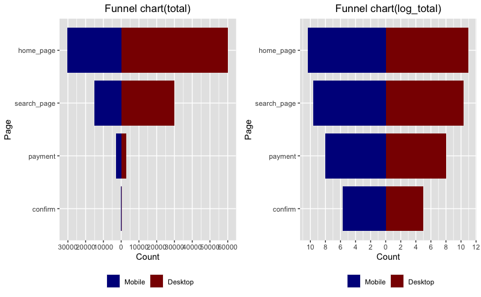

# Funnel-Analysis
generate funnel chart to reflect conversion rate

## Challenge Description
The company CEO isn't very happy with the volume of sales and, especially, of sales coming from new users. Therefore, she asked you to investigate whether there is something wrong in the conversion funnel or, in general, if you could suggest how conversion rate can be improved.
Specifically, she is interested in :
1. **A full picture of funnel conversion rate** for both desktop and mobile
2. Some insights on **what the product team should focus on** in order to improve conversion rate as well as anything you might discover that could help improve conversion rate

Note:
comments are embedded in the code file

## Funnel Chart
 
 
 
## Conclusion: 
Big potential market on female using mobile device, rather strong conversion rate.
product team should be working on the reason behind low conversion rate of desktop device and male
customers, either from advertisement standpoint, or merchandise standpoint. We might also 
consider conducting careful A/B testing to validate the conclusion or stratagy. 
